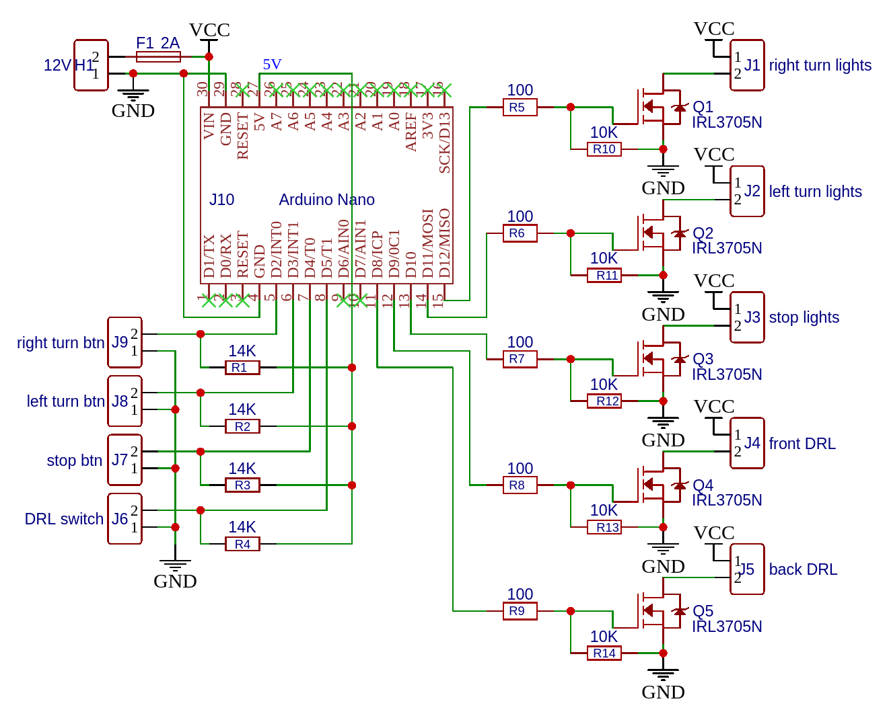
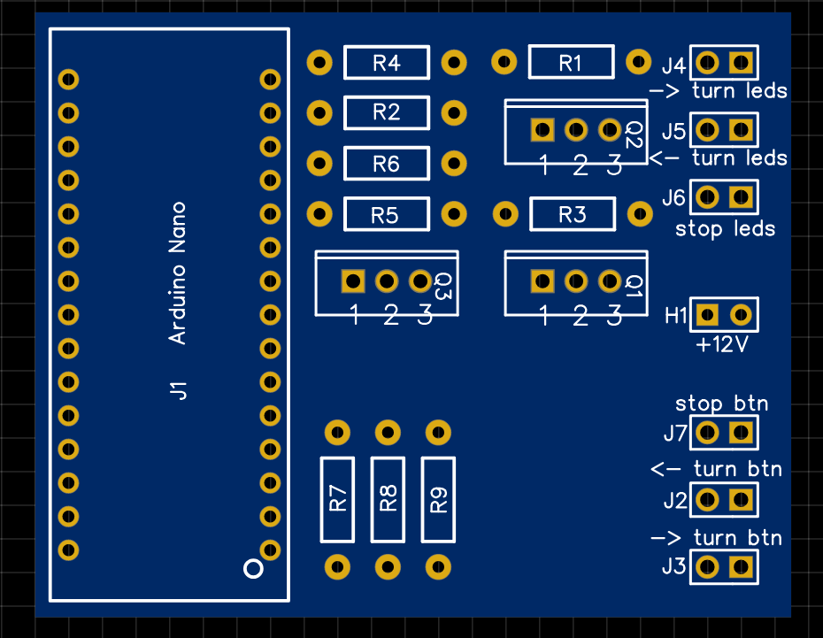
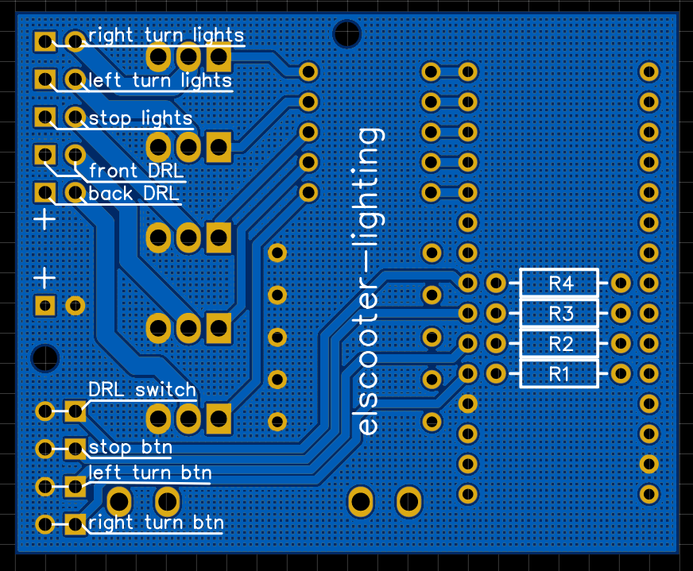

  

# Electric Scooter Lighting Firmware

[![Build Status][badge_build]][link_build]
[![License][badge_license]][link_license]

This repository contains the source code of firmware for the additional board, which installed on my electric scooter and used for lighting management, namely:

- Turning lights
- Stop signal
- Daytime running lights (DRL; front and back)

When the button, connected on `left turn btn` is pressed - lamps (12V) connected to the `left turn leds` will be blinks (about 500ms lightning will be on). The same with the `right turn btn` and `right turn leds`. Stop signal button do the then thing, but on separate pin's.

Arduino board and LEDs use the same power 12V line.

### Additional features:

- When stop button is pressed - DRL back light lamps will blinks together with the stop signal;
- Triple-click on stop signal button enables stroboscope mode for the front DRL lights;

## Schematic & PCB

Front side | Back side
:--------: | :-------:
 | 

Project for EasyEDA can be [found here][easyeda_project].

## Bill of Materials (BOM)

Type        | Description | Quantity
----------- | ----------- | --------
Fuse        | `~2A`       | 1
Fuse holder | -           | 2
Resistor    | `14 kOm` (`10..20 kOm`) | 4
Resistor    | `10 kOm`    | 5
Resistor    | `100 Om`    | 5
Mosfet      | [`IRL3705N`](https://www.infineon.com/dgdl/irl3705n.pdf?fileId=5546d462533600a40153565f29f42532) or any another analog | 5
Arduino     | `Nano`      | 1

## Recommended software for flashing the Arduino board

- `make`
- [`arduino-cli`](https://arduino.github.io/arduino-cli/latest/)

All what you need is:

- Edit `sketch.json` file (change the `port` and/or `fqbn`)
- Execute `make` without any arguments **or** open this project in ArduinoIDE and press "Upload" button

### Usefull links

- [Уроки Ардуино #9 - управление нагрузкой MOSFET транзистор](https://www.youtube.com/watch?v=hoprWM_b6V0)
- [Уроки Arduino. Расширенное управление кнопкой](https://youtu.be/BhxEpr-LMQI?t=109)

[badge_build]:https://img.shields.io/github/workflow/status/tarampampam/arduino-elscooter-lighting/tests?maxAge=30
[badge_license]:https://img.shields.io/github/license/tarampampam/arduino-elscooter-lighting.svg?longCache=true
[link_build]:https://github.com/tarampampam/arduino-elscooter-lighting/actions
[link_license]:https://github.com/tarampampam/arduino-elscooter-lighting/blob/master/LICENSE

[arduino]:https://www.arduino.cc/
[easyeda_project]:https://oshwlab.com/tarampampam/arduino-elscooter-lighting
[easyeda_editor]:https://easyeda.com/editor#id=a81d4b6eda974792aa72ebeecd0596e6|fbbeb966c847492b8f22c1e73ca057f4|
